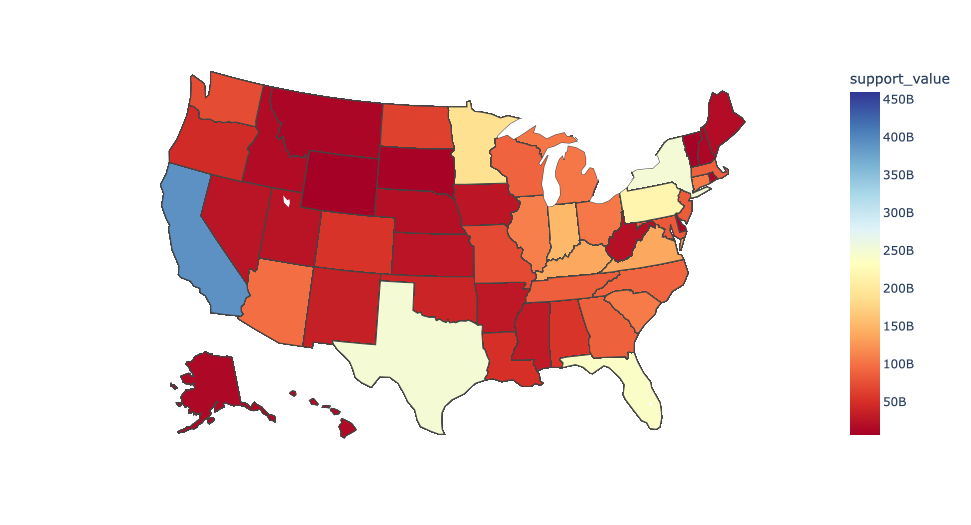

# Con-census: Climate Risk Assessment 

## Project Summary

- The initial data indicated that the New York and California have highest risk in the United States and studies found to back the findings.
- The South region has most diversed cost versus pop_density
The South region has as the author Cindy Ermus wrote in her book,"The Gulf South, and the Gulf Coast in particular, is bound together by much more than geography or the shared experience of risk and vulnerability to wind, water, erosion, and biological exchanges,” she writes. “More fundamentally, the environment has helped define the region’s identity and largely determined its history, its social fabric, and its economy.” We can assumed, based on this graph that south region has significant high risk compare to other regions.

***
[[Goal](#goal)]
[[Project Descriptions](#project-descriptions)]
[[Deliverables](#deliverables)]
[[Data Dictionary](#data-dictionary)]
[[Initial Questions](#initial-questions)]
[[Exeucitve Summary](#executive-summary)]
[[Planning](#planning)]
[[Recommendation, Conclusion, and Next Step](#recommendation,-conclusion,-and-next-step)]
[[Steps to Reproduce](#steps-to-reproduce)]
___

## Goal

- Our team aims to classify the readiness of individual communities based on data from FEMA, USDA, and state spending, to determine their ability to withstand, and respond to a variety of disasters. Our classification will identify those communities that are the most/least prepared and can influence future fund allocation as well as assist DHS’s prioritization when responding to these emergencies.
- This project aims to create a Machine Learning model to predict which State in the U.S. has most support from the government.

***
## Project Descriptions

- Climate Change and Global Warming refer to the long term shift in termperature and weather. Which impacts the Earth's climate system. 'Due to climate change, deserts are expanding, while heat waves and wildfires are becoming more common. Increased warming in the Arctic has contributed to melting permafrost, glacial retreat and sea ice loss. Higher temperatures are also causing more intense storms, droughts, and other weather extremes.' [Wikipedia](https://en.wikipedia.org/wiki/Climate_change).
- 'Sixty percent of Fortune 500 companies have set goals to act on the climate crisis and address energy use,'[worldwildlife.org](https://www.worldwildlife.org/stories/fortune-500-companies-are-acting-on-the-climate-crisis-but-is-it-enough). This project will hope to create a supporting level that a region received to help Fortune 500 companies to identify potential business risk. The project would also assist people to decide which community would be idea to move into.

***
## Deliverables
- Final Notebook
- Slides

***
## Data Dictionary

|Target|Definition
|:-------|:----------|
|support_level|Classification of county based on available funding|

|Feature|Definition|
|:-------|:----------|

|full_state  |State Name|
|state   |State Abbreviation|
|county  |County Name|
|stcofips  |FIPS Location Data|
|population    |County Population|
|area   |Area (sq mi)|
|pop_density   |Population Density|
|fema_per_county   |FEMA funding per county|
|risk_score       |National Risk Index - Score - Composite|
|avln_ealt   |Avalanche - Estimated Annual Total Loss|
|cfld_ealt   |Coastal Flooding - Estimated Annual Total Loss|
|cwav_ealt   |Cold Wave - Estimated Annual Total Loss|
|drgt_ealt   |Drought - Estimated Annual Total Loss|
|erqk_ealt   |Earthquake - Estimated Annual Total Loss|
|hail_ealt   |Hail - Estimated Annual Total Loss|
|hwav_ealt   |Heat Wave - Estimated Annual Total Loss|
|hrcn_ealt   |Hurricane - Estimated Annual Total Loss|
|istm_ealt   |Ice Storm - Estimated Annual Total Loss|
|lnds_ealt   |Landslide - Estimated Annual Total Loss|
|ltng_ealt   |Lightning - Estimated Annual Total Loss|
|rfld_ealt   |Riverine Flooding - Estimated Annual Total Loss|
|swnd_ealt   |Strong Wind - Estimated Annual Total Loss|
|trnd_ealt   |Tornado - Estimated Annual Total Loss|
|tsun_ealt   |Tsunami - Estimated Annual Total Loss|
|vlcn_ealt   |Volcanic Activity - Estimated Annual Total Loss|
|wfir_ealt   |Wildfire - Estimated Annual Total Loss|
|wntw_ealt   |Winter Storm - Estimated Annual Total Loss|
|max_cost | Disaster that causes most monetary damage in county
|county_funding |Funding collected through taxes|
|deficit |Money left over following most expensive disaster
|support level  |what is the level of the support that the government rendered|

***
## Planning
- We create README.md file
- Create wrangle.py file
    - wrangle.py will clean the datasets from various website
    - the wrangle will set a strong foundation for our exploration and modeling
- Create explore.py file
    - we will ask some intial questions, and assumptions during this phase
    - we will further expand our questions scope as we discover information from our dataset
- we will create the classification model to support our discover

***
## Initial Questions
- Whether the dense of the populatop matter
- The cost of the disaster per region
- The south region has higher risk than any other regions

***
# Recommendation, Conclusion, and Next Step

## Recommendation
- The New York and California have the highest support_level. A seperated studies are recommended
- Climate change should be our national top concern, and higher amount of funding should be allocated.
- The KNN is our best model in our training, so we used it in our test. The model achived 90% accuracy 

## Conclusion 
- The initial data indicated that the New York and California have highest risk in the United States and studies found to back the findings.
- The South region has most diversed cost versus pop_density
- The South region has, as the author Cindy Ermus wrote in her book,"The Gulf South, and the Gulf Coast in particular, is bound together by much more than geography or the shared experience of risk and vulnerability to wind, water, erosion, and biological exchanges,” she writes. “More fundamentally, the environment has helped define the region’s identity and largely determined its history, its social fabric, and its economy.” We can assumed, based on this graph that south region has significant high risk compare to other regions

## Next Step
- Expand the scope of the data
- Improvise the machine learning model
- Would do a seperate studies regarding New York and California

***
## Steps to Reproduce
- Download the folder and all files from the repo
- install tabula and plotly libary
- Enjoy!
***
